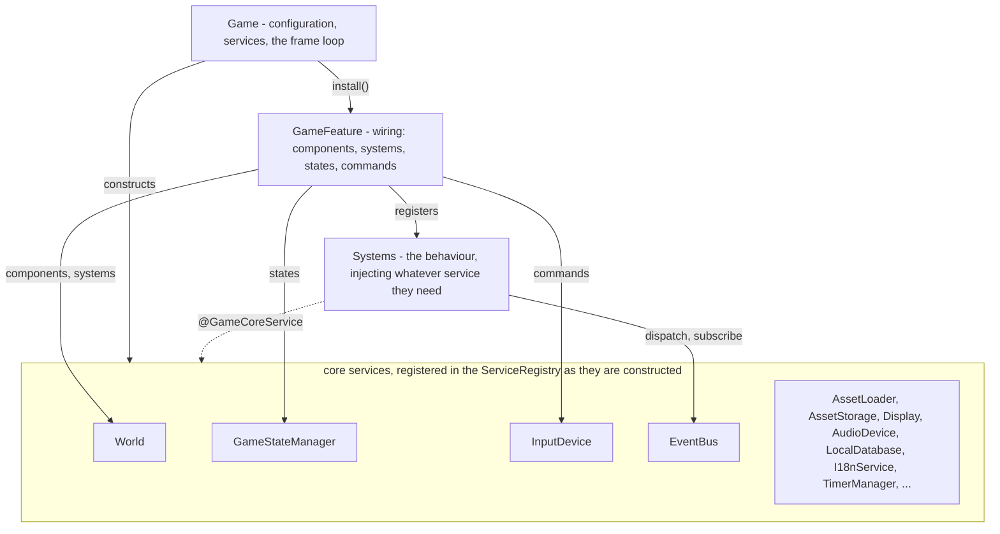
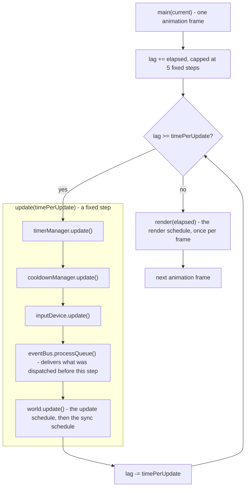
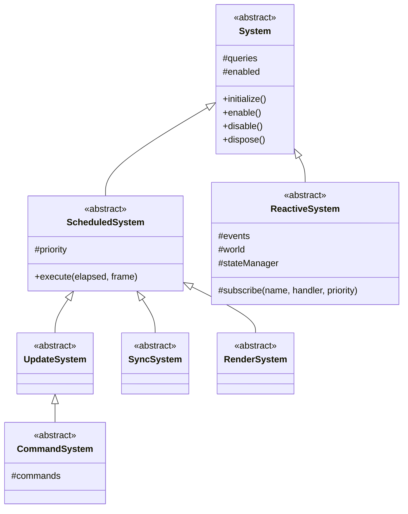
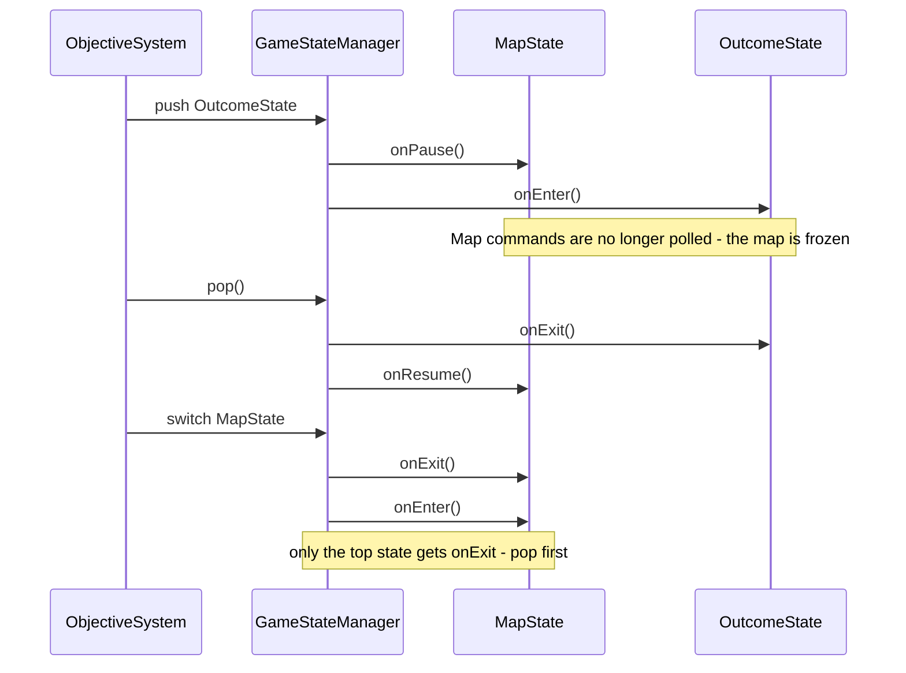
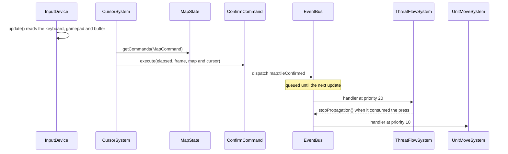

# Vigilans Nexum

[](https://github.com/DonColon/vigilans-nexum/actions/workflows/ci-build.yml) [](https://codecov.io/gh/DonColon/vigilans-nexum) [](https://sonarcloud.io/summary/new_code?id=DonColon_vigilans-nexum)

Vigilans Nexum is a tactical, turn- and tile-based RPG about trust and the invisible bonds between the people on a battlefield. It is inspired by the Fire Emblem series and aims to capture the essence of those games with its own twist on the mechanics.

The repository holds two things: a small, game-agnostic **framework** in `src/core` - an entity-component-system, a state stack, input commands, an event bus, asset loading, audio, savegames - and the **game** built on it in `src/game`, one feature per folder. This document is written for a developer joining the project: it explains how the framework works and how the game is put together on top of it.

## Table of contents

- [Getting started](#getting-started)
- [Project layout](#project-layout)
- [Features](#features)
- [Framework overview](#framework-overview)
- [The frame loop and event timing](#the-frame-loop-and-event-timing)
- [GameFeature](#gamefeature)
- [Entities, components and queries](#entities-components-and-queries)
  - [Savegames](#savegames)
- [Systems](#systems)
  - [Render layers and priorities](#render-layers-and-priorities)
- [Game states and commands](#game-states-and-commands)
- [Events](#events)
- [Services and dependency injection](#services-and-dependency-injection)
- [Building a feature](#building-a-feature)
  - [Folder contract](#folder-contract)
  - [Walkthrough: the objective feature](#walkthrough-the-objective-feature)
  - [Testing a feature](#testing-a-feature)
- [Content and assets](#content-and-assets)
- [Quality and CI](#quality-and-ci)
- [License](#license)

## Getting started

Requires Node 20 or newer (CI builds on 20, 22 and 24). There are no runtime dependencies; everything in `package.json` is tooling.

```
npm install
npm start               # Vite dev server with hot reload, on all interfaces
npm test                # Vitest in watch mode
npm run test:coverage   # one run with Istanbul coverage
npm run lint            # ESLint, including the layering rules described below
npm run format:check    # Prettier
npm run build           # type-check, then bundle to dist/
npm run build:preview   # serve the bundle
```

Tests run one file at a time (`fileParallelism: false` in `vitest.config.ts`): `vitest.setup.ts` seeds process-wide singletons - the `World`, the `EventBus`, the asset bundle - into the service registry, so files cannot share a process safely.

In development the running game is exposed as `window.game` (`src/index.ts`). Browser automation and a backgrounded tab both throttle `requestAnimationFrame` to a stop; `game.step(elapsed?)` runs one fixed update and one render by hand, which is how the game is driven from the console or a script when that happens.

```ts
// src/index.ts - stripped from production builds
if (import.meta.env.DEV) {
	(window as unknown as { game: Game }).game = game;
}
```

## Project layout

```
vigilans-nexum
├── src
│   ├── assets                    # Vite's publicDir: copied verbatim, fetched at runtime
│   │   ├── data                  # The game's content as JSON (see "Content and assets")
│   │   │   ├── catalog           # classes, weapons, items - the rulebook every sheet resolves against
│   │   │   ├── units             # one *.unit.json per character
│   │   │   ├── deployments       # which units a battle starts with, where, and what it is won by
│   │   │   ├── maps              # *.tilemap.json
│   │   │   ├── houses, locks, conversations
│   │   ├── fonts, icons, tilesets, ui
│   │   └── manifest.json         # the web app manifest (PWA), not the asset manifest
│   ├── core                      # The framework - knows nothing about this game
│   │   ├── assets                # AssetManifest, AssetLoader, AssetStorage
│   │   ├── audio                 # AudioDevice over a mixer, channels and voices
│   │   ├── database              # LocalDatabase and Repository over IndexedDB
│   │   ├── ecs                   # World, Entity, Component, Query, the System kinds
│   │   ├── events                # EventBus, EventQueue, EventHistory
│   │   ├── graphics              # Display, Graphics, Color, styles, Spritesheet
│   │   ├── i18n                  # I18nService, locale catalog and validation
│   │   ├── input                 # InputDevice, its devices, the buffer, GameCommand
│   │   ├── math                  # geometry, pathfinding (AStar), Randomizer, easing, spatial
│   │   ├── model                 # Savegame
│   │   ├── options               # OptionsService
│   │   ├── pool, timer, utils
│   │   ├── service               # GameCoreService decorator and the ServiceRegistry
│   │   ├── Game.ts               # configuration, services, the frame loop, install(), save/load
│   │   ├── GameFeature.ts        # the unit of installation
│   │   ├── GameState.ts          # a screen or mode, and the commands it allows
│   │   ├── GameStateManager.ts   # the state stack
│   │   ├── GameError.ts
│   │   └── UserGestures.ts       # the events that count as a user gesture (audio unlock)
│   ├── game                      # The game itself, one feature per folder
│   │   ├── objective             # every feature is laid out like this one
│   │   │   ├── commands          # input bindings, allowed per state
│   │   │   ├── components        # data shapes and the pure operations on each of them
│   │   │   ├── content           # JSON document formats and their parsers
│   │   │   ├── rules             # pure game logic over several entities or shapes
│   │   │   ├── states            # screens and modes the state manager pushes
│   │   │   ├── systems           # scheduled and reactive ECS systems
│   │   │   ├── view              # themes, layout, drawing helpers
│   │   │   ├── ObjectiveFeature.ts
│   │   │   └── index.ts
│   │   ├── ...                   # one folder per feature - see "Features"
│   │   ├── i18n                  # locale string tables (see src/game/i18n/README.md)
│   │   └── input                 # shared control bindings
│   ├── asset.manifest.ts         # the asset bundles the loader fetches
│   ├── database.schema.ts        # augmentation slot for the IndexedDB stores
│   ├── game.config.ts            # the GameConfiguration
│   ├── game.events.ts            # the typed catalogue of events features talk through
│   ├── index.html, index.css
│   └── index.ts                  # new Game(), feature installation, start()
├── test
│   ├── core                      # one spec per framework class
│   └── game                      # one folder per feature
├── eslint.config.js              # includes the import-direction rules
├── tsconfig.json, vite.config.ts, vitest.config.ts, vitest.setup.ts
└── sonar-project.properties
```

## Features

The game is one folder per feature under `src/game`, installed in this order in `src/index.ts` - each after the features it depends on. What each one owns:

| Feature | Owns |
|---|---|
| `map` | the grid, the cursor, the `MapState` the battle lives in, the terrain readout |
| `ui` | textboxes (`DialogState`), menus (`MenuState`), notices (`PopupState`) and their rendering |
| `units` | putting units on the map from the deployment sheet, their sheets, tokens and positions |
| `turn` | the turn counter, the phases, the phase banner |
| `roster` | the "Units" army list screen |
| `options` | the options screen; the settings themselves live on the core `OptionsService` |
| `combat` | "Attack": the forecast, the fight resolution, the map animation, deaths |
| `staff` | "Staff": healing an ally in reach |
| `experience` | scoring fights and heals, level-ups, the experience bar |
| `talk` | "Talk": scripted conversations between two units |
| `trade` | "Trade": swapping packs between adjacent allies |
| `convoy` | the supply train that takes what a full pack cannot |
| `visit` | "Visit": houses, their villagers and gifts |
| `locks` | "Door" / "Chest": locked doors and chests, and the keys that open them |
| `movement` | picking a unit up, its range, the walk, the unit and global command menus |
| `threat` | the enemy range overlay |
| `status` | the hover card and the unit sheet screen |
| `ai` | the enemy phase: enemies moving and fighting on their turn |
| `objective` | what the battle is won and lost by, the "Objective" readout, the seize marker on the map, the victory / defeat banner, the restart |

A new feature is added to this table at its install position - the [Building a feature](#building-a-feature) section says how one is built.

## Framework overview

`Game` is the composition root. Its constructor builds every core service - in order: `I18nService`, `EventBus`, `PoolManager`, `LocalDatabase`, `AssetStorage`, `AssetLoader`, `GameStateManager`, `Display`, `InputDevice`, `AudioDevice`, `TimerManager`, `CooldownManager`, `World` - from one `GameConfiguration` (`src/game.config.ts`). Each of those classes is decorated with `@GameCoreService()`, so constructing it registers it as a singleton that anything else can inject. The engine registers exactly one piece of ECS infrastructure itself, the `TransformComponent` and its `TransformSystem` at sync priority 0; everything else is a feature.

Between `new Game(config)` and `game.start()` the caller installs features. `start()` loads the initial asset bundle, switches to the initial state and starts the loop:

```ts
// src/core/Game.ts
public async start() {
	await this.assetLoader.load(this.config.initial.bundle);

	this.stateManager.switch(this.config.initial.state);
	await this.resume();
}
```

The bundle is awaited rather than listened for through the `bundleLoaded` event, because dispatched events are queued and only delivered by the loop that `start` is about to set off.



The four services a feature deals with directly are the `World` (entities, components, systems), the `GameStateManager` (the state stack), the `InputDevice` (commands) and the `EventBus` (how features talk). The rest - assets, display, audio, database, i18n, options, timers - are reached the same way, through injection, by whichever system needs them.

## The frame loop and event timing

The loop is a fixed-timestep loop. `timePerUpdate = 1000 / maxFPS` (16.67 ms at the configured 60), and each animation frame runs as many updates as the accumulated lag allows, capped at `maxCatchUpSteps = 5` so a stalled tab does not run hundreds of updates in one frame. Rendering happens once per animation frame with the real frame delta.



```ts
// src/core/Game.ts
private update(elapsed: number, frame: number) {
	this.timerManager.update(elapsed);
	this.cooldownManager.update(elapsed);
	this.inputDevice.update();
	this.eventBus.processQueue();
	this.world.update(elapsed, frame);
}
```

The order inside `update` is the timing model everything else relies on:

- **Events are delivered one frame later.** `EventBus.dispatch` only enqueues. `processQueue` takes a snapshot of the queue at the start of the update and delivers it; anything dispatched while handling - by a handler, or by a system later in the same update - lands in the *next* update's pass. A handler is therefore never run in the middle of another handler or of a system's `execute`.
- **Input is read before events and systems.** A press seen by `inputDevice.update()` is visible to every command polled in that same update.
- **Queries lag entity changes by one frame.** Adding or removing a component and unregistering an entity dispatch the `entityChanged` / `entityRemoved` events that keep queries in step, so a system's query sees the change on the next update. A system that must see the live world in the same frame reads it through `world.entityWith()` / `world.entitiesWith()` instead.
- **Update runs before sync.** `World.update` runs the update schedule and then the sync schedule; render systems can rely on what the sync phase reconciled, such as the world matrices `TransformSystem` computes.

`game.step()` performs exactly one such update followed by one render, which is why it stands in for the loop in automation.

## GameFeature

A `GameFeature` is the unit of installation: a class whose whole job is to say which components, systems, states and commands belong together. It is **wiring only** - no handlers, no state. The behaviour lives in the systems it registers.

```ts
// src/game/objective/ObjectiveFeature.ts
export class ObjectiveFeature extends GameFeature {
	constructor(config: GameFeatureConfig = {}) {
		super({
			components: [ObjectiveComponent, OutcomeComponent],
			states: [OutcomeState],
			commands: [...outcomeCommands],
			systems: [
				// Event-driven: keeps and decides the objective.
				{ system: ObjectiveFlowSystem },
				// Ahead of the turn's and the enemy phase's clocks (8), so the banner
				// goes up before either moves on from a quiet map.
				{ system: ObjectiveSystem, priority: 6 },
				// Above the phase banner (58): the last thing drawn while it is up.
				{ system: OutcomeRenderSystem, priority: 59 }
			],
			...config
		});
	}
}
```

| Config field | Registered with | Explained in |
|---|---|---|
| `components` | `World.registerComponent` | [Entities, components and queries](#entities-components-and-queries) |
| `systems` | `World.registerSystem` - with a priority for a scheduled system, without one for a reactive system | [Systems](#systems) |
| `states` | `GameStateManager.registerState` | [Game states and commands](#game-states-and-commands) |
| `commands` | `InputDevice.registerCommand` | [Game states and commands](#game-states-and-commands) |
| `dependencies` | checked on install: every listed feature must already be installed, or `install()` throws | below |
| `entities`, `entityStates` | `World.registerEntity` / `registerEntityState` - blueprint entities and per-entity states; available, used by no feature of the game | - |

The `systems` entries are typed so that the wrong shape does not compile:

```ts
// src/core/GameFeature.ts
export type SystemEntry = { system: ScheduledSystemConstructor; priority: number } | { system: ReactiveSystemConstructor; priority?: never };
```

`install()` checks the dependencies, then registers in the order **components → entity states → entities → commands → states → systems** and finally calls the `onInstall()` hook. `uninstall()` reverses that order, calls `onUninstall()`, and only then drops any event subscriptions the feature made through its own `subscribe()` - so a feature tearing its state down can still react to what that dispatches. The `Game` keeps installed features by class name.

Installation order matters twice over: a feature's dependencies must be installed first, and for reactive systems that subscribe to the same event with the same priority, subscription order - install order - is delivery order. `src/index.ts` installs the game's nineteen features in that order and says why at every step:

```ts
// src/index.ts (excerpt)
const ui = new UIFeature({ demo: false });
const units = new UnitsFeature();
const turn = new TurnFeature({ dependencies: [units] });
const combat = new CombatFeature({ dependencies: [units] });
const movement = new MovementFeature({ dependencies: [units, ui] });
const ai = new AIFeature({ dependencies: [units, turn, combat, movement] });

game.install(new MapFeature());
game.install(ui);
game.install(units);
game.install(turn);
// ...
game.install(ai);
game.install(new ObjectiveFeature({ dependencies: [units, turn, ai] }));
game.start();
```

## Entities, components and queries

An **entity** is an id and a bag of components. A **component** is one data shape plus the pure operations on that shape. A **query** is the live list of entities carrying a given set of components. Behaviour lives in systems, never on entities or components.

```ts
// src/game/objective/components/ObjectiveComponent.ts
export interface ObjectiveData extends JsonSchema {
	win: WinCondition;
	seizeColumn: number;
	seizeRow: number;
	outcome: Outcome | "";
}

export class ObjectiveComponent extends Component<ObjectiveData> {
	public static readonly type = "objective";

	public static isSeizeTile(objective: ObjectiveData, tile: GridPositionData): boolean {
		return objective.win === WinCondition.SEIZE && objective.seizeColumn === tile.column && objective.seizeRow === tile.row;
	}
}
```

- `Component<T extends JsonSchema>` - the data must be JSON-serialisable (`JsonSchema` is a record of strings, numbers, booleans, nested records and arrays of those), because component data is exactly what a savegame persists.
- `static readonly type` is the key the component is registered, queried and serialised under. It must be declared by every component and must **not** be derived from the class name: a minifier renames classes, which would silently invalidate every existing savegame on the next build. `World.registerComponent` rejects a component that still carries the base placeholder.
- `read()` returns a live, read-only view for systems that read every frame; do not mutate it. `update(data)` replaces the data, which keeps the component the owner of it. `toObject()` returns a detached `structuredClone`.
- Pure operations on **one** shape are `static` methods on the component (`UnitComponent.equip(data, index)`, `GridComponent.terrainAt(grid, column, row)`). They take the data, return new data, and never touch an entity or the world. Anything that needs a second shape or an entity is a rule (see [Building a feature](#building-a-feature)).
- `TagComponent` is a component with no data - a marker such as `CursorComponent` or `CommanderComponent`.

Entities are created with `world.createEntity(id?)` (the id defaults to a UUID) and carry components through `addComponent(Type, data)`, `getComponent(Type)`, `removeComponent(Type)`, `hasComponent(Type)`. `world.unregisterEntity(entity)` removes one; `world.entitiesWith(Type)` and `world.entityWith(Type)` look them up on the live world. Every entity also has its own small `GameStateManager` for per-entity states, which the game does not use yet.

A `Query` is declared in a system's `initialize()`:

```ts
this.queries = {
	turns: new Query({ allowlist: [TurnComponent] }),
	units: new Query({ allowlist: [UnitComponent] })
};
```

It is seeded from the world when constructed and kept in step by the `entityChanged` / `entityRemoved` events - which, being events, arrive one update after the change. `getResult()` returns the live array, `getSingleResult()` the first match or `null`. A query is disposed with its system.

`TransformComponent` (`x, y, scaleX, scaleY, rotation, parent`) is the one component the engine provides. `parent` names another entity; `TransformSystem` resolves world matrices through the parent chain in the sync phase, so a unit parented to the map moves with it and a cursor parented to the map keeps tile coordinates.

### Savegames

`Game.save(slot)` writes, into the `savegames` IndexedDB repository, the play time, a screenshot, the random generator's state, the state stack as a list of `static type` ids and every entity as `entity.toObject()`:

```ts
// src/core/Game.ts
const savegame: Savegame = {
	id: slot,
	playtime: this.timer,
	modifiedOn: new Date().toISOString(),
	screenshot: await this.display.screenshot(),
	currentState: states.map((state) => (state.constructor as GameStateConstructor).type),
	entities: entities.map((entity) => entity.toObject()),
	randomState: getRandomState()
};
```

`Game.load(slot)` restores the timer and the random state, re-registers every entity through `Entity.parse` (each component by its `type`) and pushes each saved state. Three consequences for feature code: component data must stay JSON-serialisable; components **and** states need a stable `static type`; state that only lives between two events and is not worth persisting belongs on the system, not on a component.

## Systems

Systems are where behaviour lives. There are two families: **scheduled** systems run every frame at a priority, **reactive** systems run on events and have no priority.



| Kind | Runs | Meant for | Registered as |
|---|---|---|---|
| `UpdateSystem` | every fixed update, in the update schedule | the game's logic clock: animations, timers, state machines on components, polling commands | `{ system, priority }` |
| `SyncSystem` | every fixed update, after every update system | reconciling what the update systems wrote - `TransformSystem` resolves world matrices here | `{ system, priority }` |
| `RenderSystem` | once per animation frame, in the render schedule | drawing; it never writes game state | `{ system, priority }` |
| `CommandSystem` | an `UpdateSystem` | running state-independent `GlobalCommand`s (none in the game yet) | `{ system, priority }` |
| `ReactiveSystem` | when an event it subscribed to is delivered | everything that happens *because* something happened - the feature flows | `{ system }` |

A system has two ends the World owns. It is **constructed** - `System`'s constructor sets up the queries map and the enabled flag and nothing else - and, once construction is complete and every subclass's field initializers have run, the World calls **`initialize()`**: that is where a scheduled system declares its queries and a reactive system subscribes. On `unregisterSystem` the World calls `dispose()`, which drops the queries and the subscriptions. `initialize()` returns the system, so a spec that builds one by hand does the same in one expression:

```ts
// src/core/ecs/World.ts
const system = new (systemType as new (priority?: number) => System)(priority);
system.initialize();
```

```ts
// in a spec
const system = new TurnSystem(8).initialize();
system.execute(16, 0);
system.dispose();
```

**Scheduled systems** are inserted into their schedule by priority, lowest first (`ScheduledSystem.byPriority`). `World.registerSystem` has two overloads - `(ScheduledSystemConstructor, priority)` and `(ReactiveSystemConstructor)` - and refuses the wrong combination at runtime: a scheduled system without a priority ("runs on the clock and needs a priority"), a reactive system with one ("runs on events and has no priority - order its handlers with subscribe(name, handler, priority)").

**Reactive systems** subscribe in `initialize()`; the handlers are the behaviour. The wrapper only runs a handler while the system is enabled, and `dispose()` drops every subscription. Where order matters it is order *among the handlers of one event*, and it is said on the subscription: higher runs first, and a handler may `stopPropagation()` before the rest see it.

```ts
// src/game/objective/systems/ObjectiveFlowSystem.ts
public initialize(): this {
	this.subscribe("map:ready", () => this.open());
	this.subscribe("map:closed", () => this.close());
	// Below the combat feature's own handler (0), so the fallen unit is already gone.
	this.subscribe("unit:died", () => this.check(), -1);
	this.subscribe("seize:requested", (event) => this.onSeize(event));

	return this;
}
```

A reactive system injects the `EventBus`, the `World` and the `GameStateManager` for its subclasses. The convention for naming them is `<Feature>FlowSystem`.

Where does state go? Persistent state is component data. State that only lives between two events - a pending handover, the row a list was left on, a subscription to be dropped later - stays on the system as a `declare`d field, is cleared on `map:closed`, and is never persisted.

### Render layers and priorities

The `Display` creates one canvas per configured layer (`background`, `gameplay`, `ui`, in that z-order). Each layer is owned and cleared by exactly one render system, at the lowest render priority on that layer; every other system drawing on the layer registers above it. Priorities in use:

| Schedule | Priority | Systems |
|---|---|---|
| update | 6 | `ObjectiveSystem` - ahead of the two clocks it must beat to a quiet map |
| update | 8 | the clocks: `TurnSystem`, `PhaseBannerSystem`, `BattleAnimationSystem`, `ExperienceSystem`, `EnemyPhaseSystem`, `UnitWalkSystem`, `UnitPopSystem` |
| update | 10 | the screens, polling their commands: `CursorSystem`, `MenuSystem`, `DialogSystem`, `PopupSystem`, `ForecastSystem`, `TradeSystem`, `StaffChoiceSystem`, `TalkChoiceSystem`, `OptionsSystem`, `RosterSystem`, `StatusSystem`, `ObjectiveScreenSystem` |
| update | 12 | `PathPreviewSystem` - after the cursor has moved |
| sync | 0 | `TransformSystem` |
| render `background` | 10 | `GridRenderSystem` - **clears the layer** |
| render `background` | 14, 15, 16, 17, 18 | `TileMapRenderSystem`, `SeizeMarkerRenderSystem`, `ThreatRenderSystem`, `MovementRenderSystem`, `UnitRenderSystem` |
| render `gameplay` | 20 | `CursorRenderSystem` - **clears the layer** |
| render `ui` | 50 | `UIRenderSystem` - **clears the layer**; menus, textboxes, popups |
| render `ui` | 51-56 | `UnitCardRenderSystem` (51), `ForecastRenderSystem` and `ExperienceRenderSystem` (52), `TradeRenderSystem` (53), `TileInfoRenderSystem` (54), `TurnRenderSystem` (55), the options, roster, status and objective screens (56) |
| render `ui` | 58, 59 | `PhaseBannerRenderSystem`, `OutcomeRenderSystem` - the banners, over everything |

Clearing is what takes a box off the screen: the frame after its state is popped, the owning render system clears the layer and nothing draws the box again.

## Game states and commands

A `GameState` is a screen or a mode - the battle map, a menu, a forecast, the enemy phase - and, with it, the list of commands the player may trigger while it is the **active** state. States live on a stack managed by the `GameStateManager`; only the state on top is active.

```ts
// src/game/objective/states/OutcomeState.ts
export class OutcomeState extends GameState {
	public static readonly type = "outcome";

	protected commands = [...outcomeCommands];

	@GameCoreService(World)
	private world!: World;

	public onEnter(): void {
		// ... creates the banner entity ...
		this.resetCommands();
	}

	public onExit(): void { /* removes it */ }
	public onPause(): void {}
	public onResume(): void {
		this.resetCommands();
	}
}
```

- `static type` is the id savegames store the stack under - the same rule as for components, never derived from the class name.
- `commands` lists the command *classes* allowed here. `getCommands(family?)` resolves the instances from the `InputDevice` and narrows them to one family, so a system only sees the commands it knows how to run.
- `resetCommands()` forgets every held input on those commands and flushes the shared input buffer. States call it in `onEnter` and `onResume`; without the flush, a single confirm press cascades through every state it opens, because the buffer keeps replaying it for a few frames.

The manager keeps one instance per registered state type. `push` pauses the top state and enters the new one; `pop` exits the top and resumes the one below; `peek` returns the top; `getState(Ctor)` returns the typed instance so a caller can hand it a request before pushing it. `switch` replaces the whole stack - and calls `onExit` on the **top** state only, dropping anything under it silently. Code that restarts the map therefore pops down to it first (`ObjectiveSystem.restart()`).



A **command** is a named, rebindable input tied to an action. `GameCommand<Context>` takes an `InputBinding` and an optional `RepeatPolicy { delay, rate }`; `execute(elapsed, frame, context)` decides whether the player is asking for it right now - condition, held state, repeat timing - and if so runs `action`. Without a repeat policy a command fires once per press however long the key is held; with one it fires again every `rate` milliseconds after `delay` (the cursor: `pressedOrHeld(input), { delay: 250, rate: 45 }`). A command must be executed at most once per update.

```ts
// src/game/objective/commands/OutcomeCommands.ts
export abstract class OutcomeCommand extends GameCommand<OutcomeCommandContext> {}

abstract class AcknowledgeOutcomeCommand extends OutcomeCommand {
	protected action(_elapsed: number, _frame: number, { outcome }: OutcomeCommandContext): void {
		const component = outcome.getComponent(OutcomeComponent);
		const data = component.read();

		if (outcomeAcceptsPress(data.elapsed)) {
			component.update({ ...data, acknowledged: true });
		}
	}
}

export class ConfirmOutcomeCommand extends AcknowledgeOutcomeCommand {
	constructor() {
		super(confirmBinding());
	}
}
```

Commands are grouped in **families** - an abstract class per context, `MapCommand`, `MenuCommand`, `OutcomeCommand` - and the system that owns the entities assembles that context and polls the family on the top state. A command never looks entities up itself, and never pops a state: it writes to a component and the system reacts.

```ts
// src/game/map/systems/CursorSystem.ts
private runCommands(elapsed: number, frame: number, context: MapCommandContext) {
	const state = this.stateManager.peek();

	if (!(state instanceof MapState)) {
		return;
	}

	for (const command of state.getCommands(MapCommand)) {
		command.execute(elapsed, frame, context);
	}
}
```

This is how a pushed state freezes the one below it: `CursorSystem` only polls while the `MapState` is on top, and a menu, a fight animation or the enemy phase simply does not list the map commands. No system has to know that menus exist.



Bindings are built from `InputSet`s of keyboard codes and gamepad buttons with `pressed(set)` / `pressedOrHeld(set)` (`src/core/input/commands/InputBindings.ts`), and the game names its buttons once in `src/game/input/Controls.ts`:

```ts
export const CONFIRM: InputSet = {
	keys: [KeyboardInput.ENTER, KeyboardInput.SPACE, KeyboardInput.KEY_Z, KeyboardInput.NUMPAD_ENTER],
	buttons: [GamepadInput.A]
};
```

Under the hood the `InputDevice` owns a keyboard device (listening on `window`, keyed by `event.code`), mouse and touch devices (on the display's viewport), a gamepad device (polled, with stick axes turned into virtual buttons) and one shared `InputBuffer` that keeps just-pressed and just-released edges for a few frames (configured to 5 frames / 200 ms), so a press one frame before a state opened is not lost. Commands are registered by class name. `GameCommand.bindInput()` exists for rebinding; the game has no rebinding screen yet.

## Events

Features never call each other. They dispatch and subscribe to events on the `EventBus`, and every event is declared once, with its payload, in `src/game.events.ts`:

```ts
/** The player chose "Seize" - the commander is standing on the objective's tile and claims it. */
export interface SeizeRequestedEvent extends GameEvent {
	unitId: string;
}

/** The battle is decided ... the turns stop here. */
export interface ObjectiveDecidedEvent extends GameEvent {
	outcome: Outcome;
}

declare module "@/core/events/GameEvents" {
	interface GameEvents {
		"seize:requested": SeizeRequestedEvent;
		"objective:decided": ObjectiveDecidedEvent;
		"objective:acknowledged": ObjectiveAcknowledgedEvent;
	}
}
```

The module augmentation is what makes `dispatch("objective:decided", { outcome })` and `subscribe("objective:decided", (event) => ...)` fully typed: the name is checked, the payload is inferred, and the framework's own events (`entityChanged`, `entityRemoved`, `bundleLoaded`, `bundleProgress`, `bundleUnloaded`) live in the same interface.

- `subscribe(name, handler, priority = 0)` returns the unsubscribe function; higher priorities run first, equal priorities in subscription order. A handler that throws is caught and logged; the rest still run.
- `dispatch(name, data)` enqueues. Delivery is `processQueue()`, once per update - see [the frame loop](#the-frame-loop-and-event-timing).
- `event.stopPropagation()` stops the remaining handlers of that delivery.
- The bus keeps a history (100 events in the game's configuration) with per-event statistics; `printEventStatistics()` dumps it to the console.

Names are `<feature>:<what happened>`. The game currently declares 61 of them under these prefixes: `map`, `ui`, `unit`, `combat`, `experience`, `staff`, `door` / `chest` / `lock`, `trade`, `talk`, `threat`, `convoy`, `visit`, `options`, `roster`, `status`, `turn`, `seize`, `objective`. Two conventions carry the whole game:

**Request, flow, result.** A command or a menu row asks for something (`combat:requested`, `trade:requested`, `seize:requested`); the owning feature's flow system does it and reports how it ended in the past tense (`combat:fought` then `combat:resolved`, `trade:swapped` then `trade:closed`, `objective:decided` then `objective:acknowledged`), with a `...:cancelled` when the player backed out. Whoever asked listens for the result; the feature that did the work never knows who asked.

**`map:ready` and `map:closed` are the battle's lifecycle.** The `MapState` announces `map:ready` on entering and `map:closed` on leaving. Every feature creates the entities it keeps for the length of a battle - the turn counter, the objective, the units, the houses - on `map:ready`, and removes them on `map:closed`. Nothing else needs a "reset".

```ts
// src/game/objective/systems/ObjectiveFlowSystem.ts
private decide(outcome: Outcome): void {
	const objective = this.world.entityWith(ObjectiveComponent);

	if (objective === null) {
		return;
	}

	const component = objective.getComponent(ObjectiveComponent);
	component.update({ ...component.read(), outcome });

	this.events.dispatch("objective:decided", { outcome });
}
```

## Services and dependency injection

Core services are singletons found by name in the `ServiceRegistry`, and `@GameCoreService` is the one decorator that both registers and injects them.

As a **class decorator**, `@GameCoreService()` wraps the class in a `Proxy` whose `construct` trap registers the new instance under the class name. Constructing a service is registering it; the registry keeps the first instance and ignores later registrations under the same name. The `Game` constructor is where the thirteen core services are constructed - `World`, `EventBus`, `GameStateManager`, `InputDevice`, `Display`, `AssetStorage`, `AssetLoader`, `AudioDevice`, `LocalDatabase`, `I18nService`, `TimerManager`, `CooldownManager`, `PoolManager`; the `OptionsService` is the one exception, created on first use by `getOptions()` so that settings can be read before the game exists.

As a **property decorator**, `@GameCoreService(EventBus)` or `@GameCoreService("InputDevice")` defines a lazy getter on the class prototype that resolves the service from the registry on first access and caches it. A property may name the service by class or by string; the string form exists for modules that would otherwise import in a cycle:

```ts
// src/core/GameState.ts
// Resolved by name rather than by class: states sit below the input layer
// and pulling it in would put GameState into an import cycle with it.
@GameCoreService("InputDevice")
private inputDevice!: InputDevice;
```

Two build settings exist because of this mechanism. `esbuild.keepNames: true` in `vite.config.ts` keeps class names through minification, because services, systems, features and commands are all looked up by class name. `useDefineForClassFields: false` in `tsconfig.json` keeps a decorated `private world!: World` from becoming an own property that would shadow the prototype getter.

Tests construct the services they need directly and reach the shared ones through the registry; `vitest.setup.ts` creates the `World` and the `EventBus` once per file and seeds the asset bundle:

```ts
// test/game/objective/ObjectiveFlow.spec.ts
const world = ServiceRegistry.get<World>(World.name);
const eventBus = ServiceRegistry.get<EventBus>(EventBus.name);
const assets = ServiceRegistry.get<AssetStorage>(AssetStorage.name);

new Display("objective-test", { dimension: { width: 1280, height: 720 } });
const stateManager = new GameStateManager();
new InputDevice({ gamepad: { axisThreshold: 0.5, deadZone: 0.1 } });
```

The property decorator's setter allows a test to override an injected service on a class outright.

## Building a feature

### Folder contract

Every feature under `src/game` is laid out the same way, and each folder has one job:

| Folder | Holds | May import |
|---|---|---|
| `content/` | The document formats of the JSON under `src/assets/data`, their parsers and the catalogs. | nothing from the feature. |
| `components/` | The component class **and its data interface**, plus every pure operation on that one shape as a `static`. Component data is what a savegame persists. | content, other components' data types. Never `Entity`, `World`, rules, view or systems. |
| `rules/` | Pure game logic that spans entities or several shapes - pathfinding, targeting, who can seize what. It answers a question and returns; it never writes a component or dispatches an event. | components, content, `Entity` / `World` types. Never view or systems. |
| `view/` | Themes, screen layout, menu tables, drawing helpers, animation timing, dialog and popup requests. | anything below it. |
| `states/`, `commands/` | Screens and modes, and the input bindings each of them allows. | |
| `systems/` | The behaviour: scheduled systems on the clock, reactive systems on events. | everything. |
| `<Name>Feature.ts` | **Wiring only**: which components, systems, states and commands to register. | |
| `index.ts` | The feature's public surface. | |

The import direction is enforced by `eslint.config.js` (`no-restricted-imports`), so `npm run lint` is the proof that the layering holds. The three rules and their messages:

- `components/` must not import `@/core/ecs/Entity` or `@/core/ecs/World`: *"A component holds one data shape; anything that walks entities or the world is a rule (rules/)."*
- `components/` must not import `rules/`, `view/` or `systems/`: *"A component imports only its data's vocabulary: other components' data types and content/."*
- `rules/` must not import `view/` or `systems/`: *"A rule is pure game logic; the screen and the systems sit above it."*

Where logic goes:

- Touches one data shape? A `static` on that component.
- Takes an `Entity`, the `World` or two different shapes, and only computes? `rules/`.
- Produces pixels, layout or text? `view/`.
- Describes or parses a JSON asset? `content/`.
- Decides *when* something happens - on a frame, or on an event - and writes components, pushes states or dispatches events? A system. Features never do this themselves.

### Walkthrough: the objective feature

`src/game/objective` decides what a battle is for and when it is over. It is the smallest feature that touches every folder, so it is the example throughout this document. In install order:

**1. Content.** The deployment sheet names the objective; `content/Objectives.ts` defines the vocabulary and resolves the block, falling back to a rout and saying so on the console when a sheet asks for something the build does not know:

```json
{
	"format": "vigilans-deployment",
	"version": 1,
	"map": "fantasy",
	"objective": { "win": "seize", "column": 12, "row": 5 },
	"units": [ { "unit": "dardan", "column": 4, "row": 10 }, ... ]
}
```

```ts
export const WinCondition = { ROUT: "rout", SEIZE: "seize" } as const;

export function objectiveOf(objective: DeploymentObjective | undefined): ObjectiveSetup {
	// ... validates `win` and, for a seize, its tile ...
}
```

**2. Components.** `ObjectiveComponent` (shown [above](#entities-components-and-queries)) holds the condition and, once decided, the outcome; `OutcomeComponent` is the banner on screen with its clock and whether it was acknowledged.

**3. Rules.** `rules/Outcome.ts` reads the answer off the units on the map and nothing else:

```ts
export function battleOutcome(objective: ObjectiveData, units: readonly Entity[]): Outcome | "" {
	const players = unitsOfFaction(units, UnitFaction.PLAYER);

	if (players.length === 0 || !players.some((unit) => unit.getComponent(UnitComponent).read().commander)) {
		return Outcome.DEFEAT;
	}

	if (objective.win === WinCondition.ROUT && unitsOfFaction(units, UnitFaction.ENEMY).length === 0) {
		return Outcome.VICTORY;
	}

	return "";
}
```

**4. State and commands.** `OutcomeState` is pushed over the map when the battle is decided and lists only the two acknowledge commands (shown [above](#game-states-and-commands)); while it is on top the map, and the enemy phase under it, are frozen.

**5. Systems.** `ObjectiveFlowSystem` (reactive) creates the objective on `map:ready`, drops it on `map:closed`, checks `battleOutcome` after every `unit:died` and answers `seize:requested`; deciding writes the component and dispatches `objective:decided`, which the turn feature hears and stops the counter on. `ObjectiveSystem` (update, priority 6) waits for the map to be quiet, pushes the `OutcomeState`, runs its clock and its commands, and on acknowledgement pops down to the map and enters it again - `map:closed` and `map:ready` rebuild the battle. `OutcomeRenderSystem` (render, 59) draws the banner above everything else.

**6. The feature and its installation.** `ObjectiveFeature` (shown [above](#gamefeature)) lists all of it, and `src/index.ts` installs it last, after the units, the turn and the AI it depends on.

**Adding a command-menu row.** The unit command menu and the global menu belong to the movement feature (`src/game/movement/view/UnitMenus.ts`). A feature that wants a row there - the way the objective feature has "Seize" - adds a `UnitMenuRow` id and its i18n label in `UnitMenus.ts`, a `canX` flag in `UnitCommands` and the row in `unitCommandRows()`, sets the flag in `UnitCommandSystem.openCommandMenu()` from a rule of its own (`canSeize(objective, unit)`), and handles its row in the `ui:menuConfirmed` branch of `UnitCommandSystem` by dispatching its `x:requested` event. The movement feature imports the other feature's component and rule for that; it never calls its systems.

One thing to know when writing a reactive system: anything the flow keeps between two events stays on the system as an ordinary field, is cleared on `map:closed`, and is never persisted; component data is.

### Testing a feature

A pure rule is tested directly: build the data, call the function, assert. `test/game/objective/Outcome.spec.ts`:

```ts
test("The commander falling is a defeat, whoever else is standing", () => {
	expect(battleOutcome(rout, [spawn(eliraDocument), spawn(hasanDocument)])).toBe(Outcome.DEFEAT);
});
```

A flow is tested end to end by installing the real features and driving the event queue by hand. The battle map is stood in for by a stub matched by its `type` - the framework only ever tells the map by that - and every delivery pass is one `eventBus.processQueue()`, with one pass per frame when the test needs the real loop's timing:

```ts
// test/game/objective/ObjectiveFlow.spec.ts
class MapStub extends GameState {
	public static readonly type = MapState.type;
	onEnter() {
		eventBus.dispatch("map:ready", { mapId: map.getID(), columns: 8, rows: 16 });
	}
	onExit() {
		eventBus.dispatch("map:closed", {});
	}
	onPause() {}
	onResume() {}
}
```

Features are constructed and installed in the same order as in `src/index.ts` and uninstalled in reverse in `afterEach`; scheduled systems are constructed for the frame and disposed again; `seedRandom(1)` makes the dice deterministic. Specs use Vitest's `suite` / `test`, one file per system or rule, and their titles read as sentences.

## Content and assets

The game's content - every unit, class, weapon, item, map, deployment, house, lock and conversation - is JSON under `src/assets/data`, not TypeScript. `src/assets` is Vite's `publicDir`: it is copied verbatim to the root of the build so that the `AssetLoader` can fetch it at runtime under stable, unhashed URLs. Two rules follow:

- Application code never `import`s anything from `src/assets`. It reads a document out of `AssetStorage` by the id the manifest gave it: `this.assets.getJson<T>(id)`.
- Tests may import the documents directly - `vitest.setup.ts` does, to seed `AssetStorage` under the same ids - because a test has no loader.

`src/asset.manifest.ts` declares the bundles. The game has one, `BattleMap`, which `Game.start()` loads before the first state is entered. An asset is `{ id, url, type, ... }`; the kinds are `image` (a sprite, a grid or atlas spritesheet, or an animation), `audio` (its subtype is the mixer channel), `video`, `font` (registered as a `FontFace` named by the id), `json`, `xml`, `html`, `css` and `javascript`. The loader fetches everything first (through the Cache Storage when `useCache` is set), sorts by `dependencies`, and reports `bundleProgress` and `bundleLoaded`.

```ts
// src/asset.manifest.ts (excerpt)
{ id: "deployment-skirmish", type: "json", url: "/data/deployments/skirmish.deployment.json" },
{ id: "unit-dardan", type: "json", url: "/data/units/dardan.unit.json" },
```

Every document carries a `format` and a `version`, and the feature that owns it has a parser in its `content/` folder that rejects anything else:

| Folder | `format` | Parsed by | Authors |
|---|---|---|---|
| `catalog/classes.json` | `vigilans-classes` | `units/content/UnitCatalog.ts` | class name, tier, weapon types, movement, promotion |
| `catalog/weapons.json` | `vigilans-weapons` | `units/content/UnitCatalog.ts` | might, hit, critical, weight, range, uses |
| `catalog/items.json` | `vigilans-items` | `units/content/UnitCatalog.ts` | consumables: healing, stat boosts, keys |
| `units/*.unit.json` | `vigilans-unit` | `units/content/UnitSheets.ts` | a character: faction, class, level, pack, base stats, growths, caps |
| `deployments/*.deployment.json` | `vigilans-deployment` | `units/content/Deployments.ts` | the map, the units and where they stand, each enemy's `behaviour`, the `objective` |
| `maps/*.tilemap.json` | `vigilans-tilemap` | `map/content/TileMaps.ts` | tile layers of frame indices into the tileset |
| `houses/*.houses.json` | `vigilans-houses` | `visit/content/Houses.ts` | who is in, what they say (per locale), what they hand over |
| `locks/*.locks.json` | `vigilans-locks` | `locks/content/Locks.ts` | doors and chests, their open frames and rewards |
| `conversations/*.conversations.json` | `vigilans-conversations` | `talk/content/Conversations.ts` | which pairs can talk, and the pages they say |

Adding content is therefore a data change:

- **A character** is a `*.unit.json` sheet plus a manifest entry with the id `unit-<id>`; a placement in the deployment puts it on the map.
- **An enemy's behaviour** is the optional `behaviour` on its placement (`charge` or `hold`; bosses hold by default).
- **The objective** is the `objective` block of the deployment: `{ "win": "rout" }` or `{ "win": "seize", "column", "row" }`.
- **A house, a lock or a conversation** is an entry in the scenario's sheet; the text is authored per locale inline (`{ "de": ..., "en": ... }`).

Interface strings are separate from content: flat `[locale].json` tables under `src/game/i18n`, read through `i18n(key, params)`, with the locale detected from the browser and German as the fallback. A test fails the build when the locales disagree on their keys - see [src/game/i18n/README.md](src/game/i18n/README.md).

## Quality and CI

- **TypeScript 6**, `strict`, `experimentalDecorators` (the service decorator), `emitDecoratorMetadata: false`, `useDefineForClassFields: false` (see [services](#services-and-dependency-injection)). `@/*` maps to `src/*` for both Vite and Vitest.
- **ESLint 10** flat config: `@eslint/js` and `typescript-eslint` recommended rules, Prettier as a rule, `no-console` except `warn` / `error` / `info` / `table`, and the three layering rules above.
- **Prettier**: tabs, print width 200, no trailing commas; `.editorconfig` fixes CRLF line endings.
- **Vitest 4** under jsdom with `vitest-canvas-mock`; coverage through Istanbul.
- **CI** (`.github/workflows/ci-build.yml`), on pushes to `main`, `dev` and `feature**`: format check, lint and a SonarCloud scan; a build on Node 20, 22 and 24; the test suite with coverage uploaded to Codecov; then a GitHub release of the bundle and, on `main` and `dev`, a Netlify deployment.

## License

Apache License 2.0 - see [LICENSE](LICENSE).
